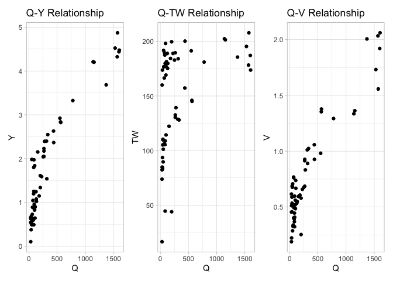
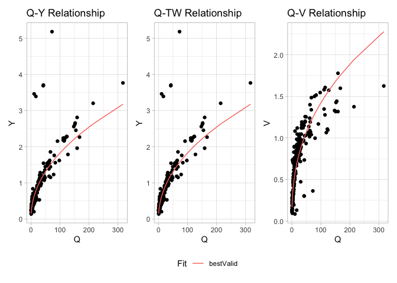

<!-- README.md is generated from README.Rmd. Please edit that file -->

# FHGestimation

Using pre-processed observation data from the USGS, we can evaluate
learn some things about estimating power law fits from noisy data.

``` r
library(FHGestimation)
load("extra/usgs_obs_hydraulics.rda")
```

Taking a random station we subset data occurring after 2010-01-01 and
that falls within the 2 year reoccurance interval (defined via NWM v21
reanalysis product). The filters are chosen based on logical bounds (in feet) found 
in historical records of bigest rivers in the U.S. (i.e., Hudson, Mississippi).
There are some gagues that are located in backwater zones and are affected by 
the coastal processes including  sea level changes, tides and storm surge 
that can extend hundreds of kilometers inland. These location often show negative
discharge vlaues.

``` r
index = 50
  
tmp = usgs_obs[[index]] %>% 
    filter(as.Date(date) > as.Date('2010-01-01')) %>% 
    filter(inChannel == TRUE) %>%
    filter(Ymean > 0 & Ymean < 216) %>%
    filter(V > 0) %>%
    filter(TW > 0 & TW < 50000) %>%
    filter(Q > 0) %>%
    filter(is.finite(Ymean)) %>% 
  select(date,Q, TW, V, Y = Ymean)

dim(tmp)
#> [1] 80  5
```



## Single Relationship fits

Here we use the `FHGestimation` package to fit the Q-Y relationship
using OLS and NLS models:

``` r
fhg_estimate(Q = tmp$Q, Y = tmp$Y, allowance = .05)
#> NLS performs best for the Q-Y realtionship
#>   type       exp      coef     nrmse   pb  mean_ape      min_ape  max_ape
#> 1    Y 0.4781663 0.2122345 0.1324314 -0.8 0.1410238 0.0084845016 2.227273
#> 2    Y 0.4102660 0.2540058 0.1542132 -2.3 0.1326987 0.0006162981 2.296017
#>   method
#> 1    nls
#> 2    ols
```

Overall the the NLS model provides a better fit (albeit small) when
measured both by nRMSE and pBais.

## Full Hydraulic fits

When we have data regarding all three hydraulic states (V,TW,Y) we can
ensure that the solutions found are physically valid (meets the
continuity constraint Q = Y x V x TW).

In this mode the OLS and NLS models are fit, and if continuity is not
met, then a Evolutionary approach is implemented. Doing so produces
three unique fits for three variables (27 total combinations). These are
crossed to identify the best performing relationships that meet
continuity at a prescribed allowance:

``` r
(x = fhg_estimate(Q = tmp$Q, 
             V = tmp$V, 
             TW = tmp$TW, 
             Y = tmp$Y, 
             allowance = .05)$output)
#> NLS performs best for the Q-Y realtionship
#> NLS performs best for the Q-TW realtionship
#> NLS performs best for the Q-V realtionship
#> NLS meets continuity ...  👍
#> OLS meets continuity ...  👍
#> The best performing method (nls) is physically valid ... 😂
#>     Y  TW   V viable   Y_error  TW_error   V_error tot_error condition
#> 1 nls nls nls   TRUE 0.1324314 0.1228453 0.1710605 0.4263372       nls
#> 2 ols nls ols   TRUE 0.1542132 0.1228453 0.1954694 0.4725279     combo
#> 3 ols ols ols   TRUE 0.1542132 0.1238710 0.1954694 0.4735535       ols
#>           c         f        a         b         k         m        r
#> 1 0.2122345 0.4781663 18.37954 0.1746765 0.2682225 0.3370959 2.737440
#> 2 0.2540058 0.4102660 18.37954 0.1746765 0.2074655 0.4250980 2.348719
#> 3 0.2540058 0.4102660 18.73285 0.1638955 0.2074655 0.4250980 2.503217
```

In the above example we see that NLS was able to provide better fits the
OLS but neither NLS or OLS was able to provide physically valid
solutions (c1, c2, viable). While the GA approach was able to provide a
physically valid solution, its error was almost 10% higher then the
OLS/NLS methods.

However a combined approach of a NLS, OLS, and GA fit was able to
provide a physically valid result with only 0.9% more error the seen in
the best performing NLS method.

There are erroneous cases that are often casued by combination of limited 
number of measurments (e.g., less than 5) and inaccurate or mistakes in 
measurments that result in a flipped curve where the relation between
discharge and width and/or depth is reversed. We can filterout such stations by:

``` r
x = x %>% 
    filter(b > 0) %>% 
    filter(f > 0) %>% 
    filter(m > 0) %>% 
```



## Take home points of this work:

> NLS is better then OLS for predicting single relationships in almost
> every case and should become the defacto approach.

> When fitting an entire system, OLS and NLS often provide results that
> are not physically valid.

> EA approaches can always find a physically valid solution but often
> introduce disproportionate error.

> Instead, using a mishmash of NLS, OLS, and GA fits (in cases of
> non-valid solutions), can find solutions with minimal error AND
> physical validity. We argue this approach is the proper way to fit FHG
> relationships.

> This process in formalized in the FHGestimation R packages.
