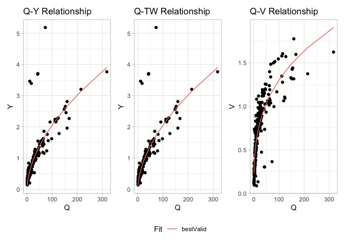
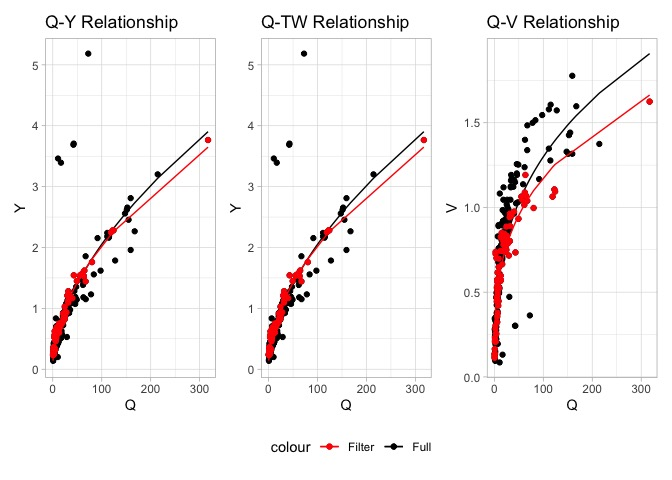

<!-- README.md is generated from README.Rmd. Please edit that file -->
<!-- badges: start -->

[](https://joss.theoj.org/papers/f7a4ff717b4430f053da9c34563e705b)
[](https://github.com/mikejohnson51/AHGestimation/actions/workflows/R-CMD-check.yaml)
[](https://choosealicense.com/licenses/mit/)
[](https://www.repostatus.org/#active)
[](https://codecov.io/github/mikejohnson51/AHGestimation)
[](#)
<!-- badges: end -->

# AHGestimation

> ***Old Citation:*** Johnson, J.M. (2022) AHGestimation: An R package
> for Computing robust, mass preserving Hydraulic Geometries and Rating
> Curves.

Using data from the USGS manual measurement (Johnson, 2018), we can
illustrate the utilities in this package. Overall this package provides
4 capabilities:

1.  Single Relation fits
2.  Full hydraulic system fits
3.  Data preprocessing
4.  Derivation of cross sections and additional hydraulic traits

## Base data

``` r
library(AHGestimation)
data = AHGestimation::nwis
```


## Single Relationship fits

Here we use the `AHGestimation` package to fit the Q-Y relationship
using OLS and NLS models:

``` r
(sf = ahg_estimate(df = select(data, Q, Y), allowance = .05))
#>   type       exp      coef nrmse    pb method
#> 1    Y 0.5185496 0.1871979  8.35 -0.18    nls
#> 2    Y 0.4797009 0.2004177  8.58 -6.19    ols
```


Overall the the NLS model provides a better fit (albeit small) when
measured both by nRMSE and pBais.

## Full Hydraulic fits

When we have data regarding three hydraulic states (V,TW,Y) we can
ensure that the solutions found are physically valid (meets the
continuity constraint Q = Y x V x TW).

In this mode the OLS and NLS models are fit, and if continuity is not
met, then a Evolutionary Approach is implemented. Doing so produces
three unique fits for three variables (27 total combinations). These are
crossed to identify the best performing relationships that meet
continuity at a prescribed allowance:

``` r
(x = ahg_estimate(data, allowance = .05))
#>   V_method TW_method Y_method viable tot_error   V_error  TW_error   Y_error
#> 1    nsga2       nls    nsga2   TRUE 0.8363382 0.2415419 0.1708646 0.4239317
#> 2    nsga2     nsga2    nsga2   TRUE 0.8363637 0.2415419 0.1708902 0.4239317
#> 3      ols       ols      ols   TRUE 0.8686964 0.2641997 0.1715093 0.4329873
#> 4      nls       nls      nls  FALSE 0.8336534 0.2412345 0.1708646 0.4215543
#>      V_coef  TW_coef    Y_coef     V_exp    TW_exp     Y_exp condition
#> 1 0.2803454 23.30572 0.1577947 0.3329645 0.1111103 0.5570045 bestValid
#> 2 0.2803454 23.31637 0.1577947 0.3329645 0.1100569 0.5570045     nsga2
#> 3 0.2155711 23.01003 0.2004177 0.4093273 0.1104173 0.4797009       ols
#> 4 0.2886315 23.30572 0.1871979 0.3273010 0.1111103 0.5185496       nls
```

Overall an combination of the OLS and NLS fit are able to provide a
error minimizing solution:



In the above example we see that NLS was able to provide better fits the
OLS but neither NLS or OLS was able to provide physically valid
solutions (viable). While the nsga2 approach was able to provide a
physically valid solution, its error was almost 10% higher then the
OLS/NLS methods.

However a combined approach of a NLS, OLS, and nsga2 was able to provide
a physically valid result with only 0.03% more error the seen in the
best performing NLS method.

\*\* This was all done using raw, unrefined data! \*\*

## Data Filtering

Due to the volatility of river systems and deviations in measurement
techniques and accuracy hydraulic data is often very noisy. While the
`ahg_estimation` tool is intended to reduce this noise and produce a
mass-conserving hydraulic fit, it is also possible to filter the data
prior to fitting. The range of data filtering options provided are
documented in the data-filtering vignette and an example is provided
below:

``` r
(xf = data %>% 
  # Keep the most recent 10 year
  date_filter(year = 10, keep_max = TRUE) %>% 
  # Keep data within 3 Median absolute deviations (log residuals)
  mad_filter() %>% 
  # Keep data that respects the Q = vA criteria w/in allowance
  qva_filter() %>% 
  ahg_estimate())
#>   V_method TW_method Y_method viable tot_error   V_error  TW_error    Y_error
#> 1      nls       nls      nls   TRUE 0.3868315 0.1737420 0.1235461 0.08954336
#> 2      nls       nls      nls   TRUE 0.3868315 0.1737420 0.1235461 0.08954336
#> 3      ols       ols      ols   TRUE 0.4869776 0.2216127 0.1255148 0.13985007
#>      V_coef  TW_coef    Y_coef     V_exp    TW_exp     Y_exp condition
#> 1 0.2938667 17.98606 0.1934940 0.3009787 0.1874598 0.5098970 bestValid
#> 2 0.2938667 17.98606 0.1934940 0.3009787 0.1874598 0.5098970       nls
#> 3 0.2204190 18.53150 0.2448765 0.3941493 0.1733737 0.4322574       ols
```

When the data is effectively filtered we see NLS can provide an error
minimizing, valid solution for the system that is quite different then
the full data fit:



## Hydraulic Estimation

Lastly, a range of functions have been added to extend the AHG
parameters into cross section hydraulics and geometry:

``` r
filter_data = data %>% 
  date_filter(10, keep_max = TRUE) %>% 
  nls_filter(allowance = .5) 

ahg_fit = ahg_estimate(filter_data)[1,]

(shape = compute_hydraulic_params(ahg_fit))
#>          r         p        d        R        bd        fd        md
#> 1 2.749318 0.6103574 5.427385 1.363727 0.1842508 0.5065641 0.3091851

cs = cross_section(r = shape$r,  
                   TW = max(filter_data$TW), 
                   Ymax = max(filter_data$Y))

glimpse(cs)
#> Rows: 50
#> Columns: 4
#> $ ind <int> 1, 2, 3, 4, 5, 6, 7, 8, 9, 10, 11, 12, 13, 14, 15, 16, 17, 18, 19,…
#> $ x   <dbl> 0.000000, 1.040816, 2.081633, 3.122449, 4.163265, 5.204082, 6.2448…
#> $ Y   <dbl> 3.5656665613, 3.1871221498, 2.8351885546, 2.5090304653, 2.20780341…
#> $ A   <dbl> 1.318953e+02, 1.130112e+02, 9.618829e+01, 8.127753e+01, 6.813466e+…
```


# History

The development of this package began as a graduate school project
between friends at UC Santa Barbara and UMass Amherst following the 2017
NOAA OWP Summer Institute and clear evidence channel shape may be a
limiting factor in National Water Model Performance. It has since
evolved to provide an open source utility for robust large scale data
synthesis and evaluation. Funding from the National Science Foundation
(Grants 1937099, 2033607) provided time to draft the [preprint
here](https://www.preprints.org/manuscript/202212.0390/v1) and apply an
early version of this software to the [Continental Flood Inundation
Mapping (CFIM)](https://cfim.ornl.gov/data/) synthetic rating curve
dataset. Funding from the National Oceanic and Atmospheric
Administration’s Office of Water Prediction supported the addition of
data filtering and hydraulic estimation, improved documentation, and
code hardening. We are grateful to all involved.
