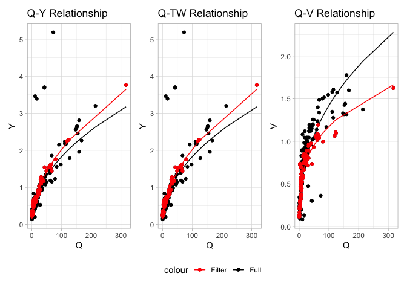

<!-- README.md is generated from README.Rmd. Please edit that file -->
<!-- badges: start -->

[](https://github.com/mikejohnson51/FHGestimation/actions/workflows/R-CMD-check.yaml)
[](https://choosealicense.com/licenses/mit/)
[](https://www.repostatus.org/#active)
[](https://codecov.io/github/mikejohnson51/FHGestimation)
[](#)
<!-- badges: end -->

# FHGestimation

> ***Citation:*** Johnson, J.M. FHGestimation[^1]: Tools for Estimating
> Physically-Based, Computationally Efficient Feature Based Hydraulic
> Geometry and Rating Curves 2022.

Using pre-processed observation data from the USGS manual measurement
(Johnson, 2018), we can evaluate learn some things about estimating
power law fits from noisy data.

Overall this package provides 4 capabilities:

1.  Single Relation fits
2.  Full hydraulic system fits
3.  Data preprocessing
4.  Derivation of cross sections and additonal hydraulic traits

## Base data

``` r
library(FHGestimation)
data = nwis
```


## Single Relationship fits

Here we use the `FHGestimation` package to fit the Q-Y relationship
using OLS and NLS models:

``` r
(sf = fhg_estimate(df = select(data, Q, Y), allowance = .05))
#>   type       exp      coef nrmse    pb method
#> 1    Y 0.5185496 0.1871979  8.35 -0.18    nls
#> 2    Y 0.4797009 0.2004177  8.58 -6.19    ols
```


Overall the the NLS model provides a better fit (albeit small) when
measured both by nRMSE and pBais.

## Full Hydraulic fits

When we have data regarding three hydraulic states (V,TW,Y) we can
ensure that the solutions found are physically valid (meets the
continuity constraint Q = Y x V x TW).

In this mode the OLS and NLS models are fit, and if continuity is not
met, then a Evolutionary Approach is implemented. Doing so produces
three unique fits for three variables (27 total combinations). These are
crossed to identify the best performing relationships that meet
continuity at a prescribed allowance:

``` r
(x = fhg_estimate(data, allowance = .05))
#>   V_method TW_method Y_method viable tot_error   V_error  TW_error   Y_error
#> 1      ols       nls      ols   TRUE 0.8680517 0.2641997 0.1708646 0.4329873
#> 2      ols       ols      ols   TRUE 0.8686964 0.2641997 0.1715093 0.4329873
#> 3    nsga2     nsga2    nsga2   TRUE 1.1345364 0.4422426 0.1835315 0.5087623
#> 4      nls       nls      nls  FALSE 0.8336534 0.2412345 0.1708646 0.4215543
#>       V_coef  TW_coef    Y_coef     V_exp     TW_exp     Y_exp condition
#> 1 0.21557110 23.30572 0.2004177 0.4093273 0.11111033 0.4797009 bestValid
#> 2 0.21557110 23.01003 0.2004177 0.4093273 0.11041728 0.4797009       ols
#> 3 0.07697966 27.46195 0.4652784 0.6141195 0.05904622 0.2969993     nsga2
#> 4 0.28863153 23.30572 0.1871979 0.3273010 0.11111033 0.5185496       nls
```

Overall an combination of the OLS and NLS fit are able to provide a
error minimizing solution:


In the above example we see that NLS was able to provide better fits the
OLS but neither NLS or OLS was able to provide physically valid
solutions (viable). While the nsga2 approach was able to provide a
physically valid solution, its error was almost 10% higher then the
OLS/NLS methods.

However a combined approach of a NLS, OLS, and nsga2 was able to provide
a physically valid result with only 0.03% more error the seen in the
best performing NLS method.

\*\* This was all done using raw, unrefined data! \*\*

## Data Filtering

Due to the volatility of river systems and deviations in measurement
techniques and accuracy hydraulic data is often very noisy. While the
`fhg_estimation` tool is intended to reduce this noise and produce a
mass-conserving hydraulic fit, it is also possible to filter the data
prior to fitting. The range of data filtering options provided are
documented in the data-filtering vignette and an example is provided
below:

``` r
(xf = data %>% 
  # Keep the most recent 10 year
  date_filter(year = 10, keep_max = TRUE) %>% 
  # Keep data within 3 Median absolute deviations (log residuals)
  mad_filter() %>% 
  # Keep data that respects the Q = vA critera w/in allowance
  qva_filter() %>% 
  fhg_estimate())
#>   V_method TW_method Y_method viable tot_error   V_error  TW_error    Y_error
#> 1      nls       nls      nls   TRUE 0.3868315 0.1737420 0.1235461 0.08954336
#> 2      nls       nls      nls   TRUE 0.3868315 0.1737420 0.1235461 0.08954336
#> 3      ols       ols      ols   TRUE 0.4869776 0.2216127 0.1255148 0.13985007
#>      V_coef  TW_coef    Y_coef     V_exp    TW_exp     Y_exp condition
#> 1 0.2938667 17.98606 0.1934940 0.3009787 0.1874598 0.5098970 bestValid
#> 2 0.2938667 17.98606 0.1934940 0.3009787 0.1874598 0.5098970       nls
#> 3 0.2204190 18.53150 0.2448765 0.3941493 0.1733737 0.4322574       ols
```

When the data is effecivly filtered we see NLS can provide an error
minimizing, valid solution for the system that is quite different then
the full data fit:



# History

The thoughts and development behind this package began in 2017 following
the NOAA OWP Summer Institute and clear evidence channel shape may be a
limiting factor in National Water Model Performance.

The algorithm and implementation began as a graduate school project at
UCSB. It has since developed and been applied with support from NSF and
NOAA to provide an open source utility for robust large scale data
synthesis and evaluation. **NSF** funding provided time to draft the
[preprint here](https://www.preprints.org/manuscript/202212.0390/v1) and
apply an early version of this tool to the
[CFIM](https://cfim.ornl.gov/data/) synthetic rating curve dataset.
**NOAA** funding supported the addition of data filtering methods,
improved documentation, and code hardening.

[^1]: previously AHGestimation
