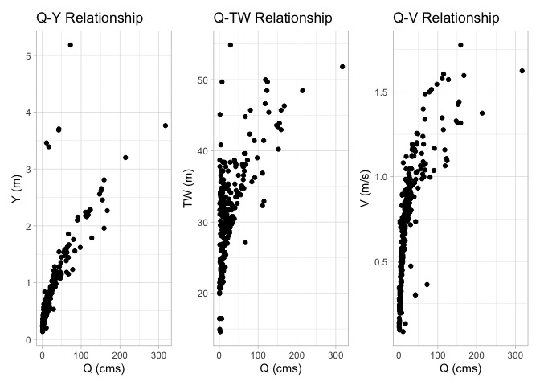
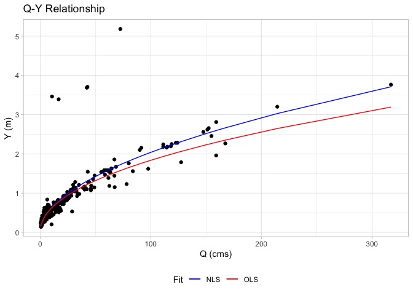
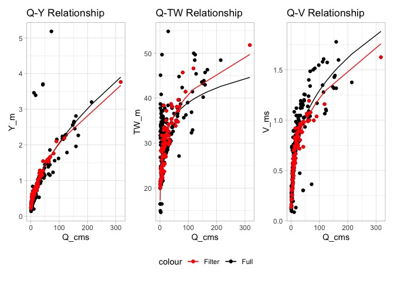
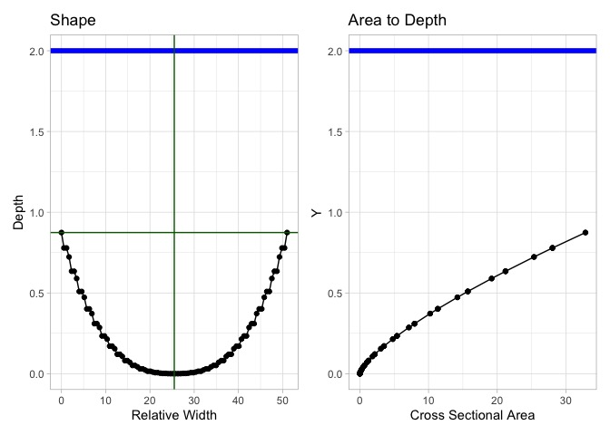

<!-- README.md is generated from README.Rmd. Please edit that file -->
<!-- badges: start -->

[](https://joss.theoj.org/papers/f7a4ff717b4430f053da9c34563e705b)
[](https://github.com/mikejohnson51/AHGestimation/actions/workflows/R-CMD-check.yaml)
[](https://choosealicense.com/licenses/mit/)
[](https://www.repostatus.org/#active)
[](https://codecov.io/github/mikejohnson51/AHGestimation)
[](#)
<!-- badges: end -->

## Installation

``` r
# install.packages("remotes")
remotes::install_packages("mikejohnson51/AHGestimation")
```

# Introduction

The behavior of a river system at a location can be represented as the
relationship between discharge (Q), mean depth (Y), mean velocity (V),
and mean top width (TW). If you have these measurements over a long
period of time, a relationship between how much water (Q) is in the
channel and the corresponding Y, V, and TW can be established. The idea
of ‘at-a-station hydraulic geometry’ (AHG) suggests three power laws can
adequatly describe these relations (Leopold and Maddock 1953):

$$
TW = a  \cdot Q^b
$$ $$
Y = c \cdot Q^f
$$

$$
V = k \cdot Q^m
$$

Each **single relationships** describes a component of the channel
behavior (see section [Fitting single
relationships](#fitting-single-relationships)). For example, the Q-Y
relation is similar to the **traditional rating curve** that relates
stage to discharge where stage is given as a height of water (H) above a
datum (Ho).

$$
Q = c \cdot (H - H_o)^f
$$

Traditionally, each relationship has been fit independent of one another
using ordinary least square regression (OLS) on the log transformed time
series of the respective components.

Some research has moved beyond pure OLS fitting with a (typically)
singular focus on the rating curve relation. For example the Texas Water
Resources Institute suggests a non linear least squares regression (NLS)
([here](https://txwri.github.io/r-manual/stage-discharge.html)), and
Bayesian hierarchical modeling have been shown in other cases to be
beneficial ((Hrafnkelsson et al. 2022), R implementation
[here](https://CRAN.R-project.org/package=bdrc))

When trying to fit a **hydraulic system** - or - all three equations -
there are additional considerations . Notably continuity dictates that
no water is gained or lost such that:

$$
Q = TW·Y·V
$$

and:

$$
(b + f + m) =  (a·c·k) = 1 
$$

**Critically, neither OLS or NLS solvers can ensure this characteristic
of the solution.** (see [Fitting hydraulic
systems](#fitting-hydraulic-systems)). Instead, this can be achieved by
either

1)  Preprocessing data based on thresholds (see Enzminger, Minear, and
    Livneh (2023) and Afshari et al. (2017)) (see AHGestimation
    functions in
    [here](https://mikejohnson51.github.io/AHGestimation/articles/data-filtering.html)),
    or
2)  as we suggest in this package, using a evolutionary solver - along
    with OLS and NLS fits - to optimally solve relationships in
    accordance with each other (see detailed description
    [here](https://mikejohnson51.github.io/AHGestimation/articles/improved-ahg.html)).

The aim of this package is to provide increased AHG fitting flexibility,
that ensures mass conservation in hydraulic systems, and optimal curve
fitting for single relations.

# AHGestimation

Using USGS field measurements at the gage located on [Nashua River at
East Pepperell,
MA](https://waterdata.usgs.gov/nwis/measurements/?site_no=01096500&agency_cd=USGS)
we can illustrate 4 capabilities this package offers:

1.  Fitting single relations with OLS and NLS ([Fitting single
    relationships](#fitting-single-relationships))
2.  Estimating hydraulic system with a mass conserving ensemble fitting
    method ([Fitting hydraulic systems](#fitting-hydraulic-systems))
3.  Data preprocessing (removing outliers based on defined criteria)
    ([Data Filtering](#data-filtering))
4.  Deriving cross section shapes and traits from the AHG fits
    ([Hydraulic Shape Estimation](#hydraulic-shape-estimation)).

The example data is included in the package, and its development can be
seen
[here](https://github.com/mikejohnson51/AHGestimation/blob/master/data-raw/nwis.R).

``` r
library(AHGestimation)
glimpse(nwis)
#> Rows: 275
#> Columns: 6
#> $ siteID <chr> "01096500", "01096500", "01096500", "01096500", "01096500", "01…
#> $ date   <date> 1984-11-14, 1985-01-04, 1985-05-06, 1985-06-26, 1986-01-09, 19…
#> $ Q_cms  <dbl> 9.740995, 11.893076, 10.817036, 1.945367, 11.355056, 21.435853,…
#> $ Y_m    <dbl> 0.5276643, 0.6263470, 0.5952224, 0.2400299, 0.5920151, 0.857459…
#> $ V_ms   <dbl> 0.652272, 0.682752, 0.563880, 0.332232, 0.606552, 0.902208, 0.4…
#> $ TW_m   <dbl> 28.3464, 27.7368, 32.3088, 24.3840, 31.6992, 27.7368, 31.6992, …
```



## Fitting single relationships

The `AHGestimation::ahg_estimate(...)` function can be used to fit
single relationships using both NLS and OLS solutions. Below we fit the
Q-Y relation by passing a `data.frame` with the column names `Q` and
`Y`. More columns could be included in the input, but only those with
`Q`, `Y`, `V`, and/or `TW` are used.

``` r
(sf = nwis %>%
   #input column names must be Q,Y,V and/or TW
   select(date, Q = Q_cms, Y = Y_m) %>% 
   ahg_estimate())
#>   type       exp      coef nrmse    pb method
#> 1    Y 0.5190562 0.1867125  7.90 -0.23    nls
#> 2    Y 0.4794202 0.2018376  8.11 -5.58    ols
```

The returned object rank sorts the solutions based on the nrmse of the
simulated Y values compared to the input data. For convenience, the
pBias is also reported. Below, we can see the variation in the NLS
(blue) and OLS (red) solutions.



When 2 relationships (e.g. Q-Y and Q-V) are passed to
`ahg_estimate(...)` the default behavior is to return a single solution
based on the minimum nrmse. Since only 2 of the 3 hydraulic traits are
passed, mass conservation cannot be checked here.

``` r
(nwis %>%
   #input column names must be Q,Y,V and/or TW
   select(Q = Q_cms, Y = Y_m, V = V_ms) %>% 
   ahg_estimate())
#>   V_method Y_method tot_nrmse   V_nrmse   Y_nrmse   V_coef    Y_coef     V_exp
#> 1      nls      nls 0.6787807 0.2312688 0.4475119 0.289889 0.1867125 0.3246968
#>       Y_exp
#> 1 0.5190562
```

If you would like all fits (OLS and NLS), the `full_fitting` parameter
can be set to `TRUE`.

``` r
(nwis %>%
   #input column names must be Q,Y,V and/or TW
   select(Q = Q_cms, Y = Y_m, V = V_ms) %>% 
   ahg_estimate(full_fitting = TRUE))
#> $full_fits
#>   V_method Y_method tot_nrmse   V_nrmse   Y_nrmse    V_coef    Y_coef     V_exp
#> 1      nls      nls 0.6787807 0.2312688 0.4475119 0.2898890 0.1867125 0.3246968
#> 2      ols      ols 0.7127124 0.2534246 0.4592878 0.2178592 0.2018376 0.4056932
#>       Y_exp
#> 1 0.5190562
#> 2 0.4794202
#> 
#> $summary
#>   V_method Y_method tot_nrmse   V_nrmse   Y_nrmse   V_coef    Y_coef     V_exp
#> 1      nls      nls 0.6787807 0.2312688 0.4475119 0.289889 0.1867125 0.3246968
#>       Y_exp
#> 1 0.5190562
```

## Fitting hydraulic systems

When we have data for all three hydraulic relationships we can ensure
the solutions found meet continuity/conserve mass.

In this mode the OLS and NLS models are fit first, and if continuity is
not met in best solution (e.g. lowest nmse), then an Evolutionary
Approach (nsga2; Mersmann (2020)) is implemented.

Doing so produces three unique fits for each relationship (27 total
combinations). These are crossed to identify the best performing
solution that meets continuity at a prescribed allowance. The allowance
specifies the amount that each continuity expression can deviate from 1.
More on this can be found at the vignette
[here](https://mikejohnson51.github.io/AHGestimation/articles/improved-ahg.html)

As before, the results are rank ordered by minimum nrmse and viability
(viable = does the solution meet continuity within the prescribed
allowance?)

``` r
(x = nwis %>% 
   select(Q = Q_cms, Y = Y_m, V = V_ms, TW = TW_m) %>% 
   ahg_estimate(allowance = .05))
#>   V_method TW_method Y_method    c1    c2 viable tot_nrmse   V_nrmse  TW_nrmse
#> 1      nls       nls    nsga2 1.048 0.997   TRUE 0.8478575 0.2312688 0.1665577
#> 2    nsga2     nsga2    nsga2 1.042 0.997   TRUE 0.8480158 0.2314216 0.1665631
#> 3      ols       ols      ols 0.994 1.000   TRUE 0.8799006 0.2534246 0.1671882
#> 4      nls       nls      nls 1.234 0.960  FALSE 0.8453383 0.2312688 0.1665577
#>     Y_nrmse    V_coef  TW_coef    Y_coef     V_exp    TW_exp     Y_exp
#> 1 0.4500311 0.2898890 22.79344 0.1586042 0.3246968 0.1166774 0.5560598
#> 2 0.4500311 0.2874600 22.86035 0.1586042 0.3248796 0.1160671 0.5560598
#> 3 0.4592878 0.2178592 22.61538 0.2018376 0.4056932 0.1145234 0.4794202
#> 4 0.4475119 0.2898890 22.79344 0.1867125 0.3246968 0.1166774 0.5190562
#>   condition
#> 1 bestValid
#> 2     nsga2
#> 3       ols
#> 4       nls
```

Overall an combination of the NLS and nsga2 provides an error
minimizing, viable solution:


## Data Filtering

Due to the volatility of river systems, hydraulic data is often very
noisy. While the `ahg_estimate` tool is intended to reduce this noise
and produce a mass-conserving hydraulic fit, it is also possible to
filter the data prior to fitting. The range of data filtering options
provided are documented in the [data-filtering
vignette](https://mikejohnson51.github.io/AHGestimation/articles/data-filtering.html)
and an example is provided below:

``` r
filtered_data = nwis %>% 
  select(date, Q = Q_cms, Y = Y_m, V = V_ms, TW = TW_m) %>% 
  # Keep the most recent 10 year
  date_filter(year = 10, keep_max = TRUE) %>% 
  # Keep data within 3 Median absolute deviations (log residuals)
  mad_filter() %>% 
  # Keep data that respects the Q = vA criteria w/in allowance
  qva_filter()
 
(ahg_fit = ahg_estimate(filtered_data))
#>   V_method TW_method Y_method    c1 c2 viable tot_nrmse   V_nrmse  TW_nrmse
#> 1      nls       nls      nls 1.012  1   TRUE 0.3443460 0.1434527 0.1022593
#> 2      nls       nls      nls 1.012  1   TRUE 0.3443460 0.1434527 0.1022593
#> 3      ols       ols      ols 0.998  1   TRUE 0.4456573 0.1908811 0.1039403
#>      Y_nrmse    V_coef  TW_coef    Y_coef     V_exp    TW_exp     Y_exp
#> 1 0.09863406 0.2812859 18.50099 0.1945125 0.3181974 0.1717161 0.5099640
#> 2 0.09863406 0.2812859 18.50099 0.1945125 0.3181974 0.1717161 0.5099640
#> 3 0.15083589 0.2099045 19.19159 0.2478285 0.4124677 0.1567236 0.4312825
#>   condition
#> 1 bestValid
#> 2       nls
#> 3       ols
```

When the data is effectively filtered we see NLS can provide an error
minimizing, valid solution for the system that is quite different then
the full data fit. Further, the nsga2 algorithm did not need to be
invoked:



## Hydraulic Shape Estimation

Lastly, a range of functions have been added to extend the AHG
parameters into cross section hydraulics and geometry. These come
primarily from (Dingman and Afshari 2018) and are described in detail
[here](https://mikejohnson51.github.io/AHGestimation/articles/hydraulics.html)

``` r
# Compute hydraulic parameters
(hydraulic_params = compute_hydraulic_params(ahg_fit))
#>          r         p        d        R        bd        fd        md
#> 1 2.969809 0.6239605 5.822852 1.336722 0.1717371 0.5100265 0.3182364
#> 2 2.969809 0.6239605 5.822852 1.336722 0.1717371 0.5100265 0.3182364
#> 3 2.751866 0.9563746 6.383682 1.363390 0.1566494 0.4310783 0.4122723

# Estimate roughness
# Slope is taken from the NHD reach associated with our gage
compute_n(filtered_data, S = 0.01463675)
#> [1] 0.1385395
```

Of particular note, the `r` value describes the theoretical shape of the
channel ranging from a triangle (r = 1) to a rectangle (r = ∞). When
paired with a TW and Depth (here assuming max of the record) a
generalized cross section can be derived. The returned data.frame
provide a point index (from left bank looking upstream) the associated
relative x and absolute Y position, and the cross sectional area for
that Y.

``` r
cs = cross_section(r = hydraulic_params$r,  
                   TW   = max(filtered_data$TW), 
                   Ymax = max(filtered_data$Y))

glimpse(cs)
#> Rows: 150
#> Columns: 4
#> $ ind <int> 1, 2, 3, 4, 5, 6, 7, 8, 9, 10, 11, 12, 13, 14, 15, 16, 17, 18, 19,…
#> $ x   <dbl> 0.0000000, 0.3422819, 0.6845638, 1.0268456, 1.3691275, 1.7114094, …
#> $ Y   <dbl> 3.565485, 3.550130, 3.550130, 3.186628, 3.144801, 3.144801, 2.8344…
#> $ A   <dbl> 132.46010, 131.56309, 131.56309, 113.75671, 111.63183, 111.63183, …
```



# History

The development of this package began as a graduate school project
between friends at UC Santa Barbara and UMass Amherst following the 2017
NOAA OWP Summer Institute and clear evidence channel shape may be a
limiting factor in National Water Model Performance. It has since
evolved to provide an open source utility for robust large scale data
synthesis and evaluation. Funding from the National Science Foundation
(Grants 1937099, 2033607) provided time to draft Johnson (2022) and
apply an early version of this software to the \[Continental Flood
Inundation Mapping (CFIM) synthetic rating curve dataset (Liu and
Maidment 2020). Funding from the National Oceanic and Atmospheric
Administration’s Office of Water Prediction supported the addition of
data filtering and hydraulic estimation, improved documentation, and
code improvement We are grateful to all involved.

# Contributing

First, thanks for considering a contribution! We hope to make this
package a community created resource!

- Please attempt to describe what you want to do prior to contributing
  by submitting an issue.
- Please follow the typical github fork - pull-request workflow.
- Contributions should be tested with `testthat` by running
  `devtools::test()`.
- Code style should attempt to follow the [tidyverse style
  guide](https://style.tidyverse.org/).
- Make sure you use `roxygen` and run `devtools::check()` before
  contributing.

Other notes:

- Consider running `goodpractice::gp()` on the package before
  contributing.
- Consider running `devtools::spell_check()` and `devtools::document()`
  if you wrote documentation.
- Consider running `devtools::build_readme()` if you made any changes.
- This package uses pkgdown. Running `pkgdown::build_site()` will
  refresh it.

# References

<div id="refs" class="references csl-bib-body hanging-indent">

<div id="ref-afshari2017statistical" class="csl-entry">

Afshari, Shahab, Balazs M Fekete, S Lawrence Dingman, Naresh Devineni,
David M Bjerklie, and Reza M Khanbilvardi. 2017. “Statistical Filtering
of River Survey and Streamflow Data for Improving at-a-Station Hydraulic
Geometry Relations.” *Journal of Hydrology* 547: 443–54.
<https://doi.org/10.1016/j.jhydrol.2017.01.038>.

</div>

<div id="ref-dingman2018field" class="csl-entry">

Dingman, S Lawrence, and Shahab Afshari. 2018. “Field Verification of
Analytical at-a-Station Hydraulic-Geometry Relations.” *Journal of
Hydrology* 564: 859–72. <https://doi.org/10.1002/aaai.12035>.

</div>

<div id="ref-enzminger_thomas_l_2023_7868764" class="csl-entry">

Enzminger, Thomas L., J. Toby Minear, and Ben Livneh. 2023.
“<span class="nocase">HyG: A hydraulic geometry dataset derived from
historical stream gage measurements across the conterminous United
States</span>.” Zenodo. <https://doi.org/10.5281/zenodo.7868764>.

</div>

<div id="ref-hrafnkelsson2022generalization" class="csl-entry">

Hrafnkelsson, Birgir, Helgi Sigurdarson, Sölvi Rögnvaldsson, Axel Örn
Jansson, Rafael Danı́el Vias, and Sigurdur M Gardarsson. 2022.
“Generalization of the Power-Law Rating Curve Using Hydrodynamic Theory
and Bayesian Hierarchical Modeling.” *Environmetrics* 33 (2): e2711.

</div>

<div id="ref-preprint" class="csl-entry">

Johnson, J.; Clarke, J. M.; Coll. 2022. *Determining Feature Based
Hydraulic Geometry and Rating Curves Using a Physically Based,
Computationally Efficient Framework*. *Preprints*.
<https://doi.org/10.20944/preprints202212.0390.v1>.

</div>

<div id="ref-leopold1953hydraulic" class="csl-entry">

Leopold, Luna Bergere, and Thomas Maddock. 1953. *The Hydraulic Geometry
of Stream Channels and Some Physiographic Implications*. Vol. 252. US
Government Printing Office. <https://doi.org/10.3133/pp252>.

</div>

<div id="ref-cfim" class="csl-entry">

Liu, Tarboton, Yan Y., and David R. Maidment. 2020. *Height Above
Nearest Drainage (HAND) and Hydraulic Property Table for CONUS - Version
0.2.1. (20200601)*. *Oak Ridge Leadership Computing Facility.*
<https://cfim.ornl.gov/data/>.

</div>

<div id="ref-mco" class="csl-entry">

Mersmann, Olaf. 2020. *Mco: Multiple Criteria Optimization Algorithms
and Related Functions*. <https://CRAN.R-project.org/package=mco>.

</div>

</div>
