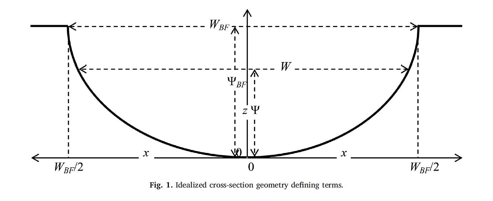

```{r, include = FALSE}
knitr::opts_chunk$set(
  collapse = TRUE,
  comment = "#>",
  out.width = "100%",
  dev = "jpeg"
)

library(AHGestimation)
library(ggplot2)
library(patchwork)
library(dplyr)
```


# Hydraulic Estimation

A primary application for AHG relations is hydraulic simulation and approximation. AHG relationships are not only useful for translating one hydraulic variable to an estimate of another, but they can be used to parameterize the shape, roughness, and behavior of a channel for routing applications applications (e.g. see Heldmeyer 2019)

## Example data

Staring with the same data in other examples, we can retain the last 10 year of data and apply an NLS filter (see section of data filtering for more)

```{r}
data <- nwis %>% 
  select(date, Q = Q_cms, Y = Y_m, TW = TW_m, V = V_ms) %>% 
  date_filter(10, keep_max = TRUE) %>% 
  nls_filter(allowance = .5)

glimpse(data)
```

## Compute Roughness

Roughness defines the friction exerted by the stream bed on water flowing through it. One way to estimate roughness is to solve Manning's equation:

$$
n = \frac{R^{2/3}S^{1/2}}{V}
$$

where V is velocity, R is hydraulic radius and S is longitudinal slope. 

We can use the smoothed reach-scale longitudinal slopes from the NHDPlusv2 by extracting the value for the gage we used by combining the `NLDI` and `get_vaa()` capabilities in `nhdplusTools.`

Following the assumptions made in the [HyG Dataset](https://zenodo.org/record/7868764) we use the median depth (Y) as an approximation for R, the median Velocity (V) from the field measurement record. Thus, we report roughness which approximates the historical median measured flow at each gage.

```{r}
library(nhdplusTools)

# Need to run for first use of get_vaa():
# nhdplusTools::download_vaa()

q <- get_nldi_feature(list("featureSource" = "nwissite", 
                          featureID = "USGS-01096500"))

att <- get_vaa("slope") %>% 
  filter(comid == q$comid)

(n <- compute_n(data, S = att$slope))
```

## Compute r, d, R and p

Dingman (2018) presented analytic derivations of the AHG parameters and how the AHG coefficients are related to cross-section hydraulics and geometry. Specifically 4 variables are called out:

### r

The exponent `r` reflects the cross-section shape where a triangle is represented by r = 1, the ‘Lane Type B stable channel’ (Henderson, 1966) by r ≈1.75, a parabola by r = 2. As r →∞, the channel becomes rectangular (Fig. 1). The value of `r` can be computed as:

$$
r = f/b
$$

```{r, echo = F, fig.cap= "Figure 1"}
knitr::include_graphics('../man/figures/dingman-r.png')
```

### p, q, k

The exponent `p` (along with `q`) exist in Chézy and Manning uniform-flow equations. In Chézy, `p` = 1/2 and Manning's, `p` = 2/3 while in both Chézy and Manning `q` = 1/2.

Since neither equation is generally dimensionally correct they require unit adjustments. and several studies have indicated that p and q have different values than assumed in the Chézy/Manning relations [e.g. Riggs (1976), Dingman and Sharma (1997), Bjerklie et al. (2005), Lopez et al. (2007), Ferguson (2007), Ferguson (2010)].

`p` can be computed as:

$$
p = m/f
$$

**The general determination of κ and p from channel characteristics (especially slope and boundary roughness) is a central problem in open-channel hydraulics that has resisted simple solution**. In practice, coefficient κ and  exponent p can be determined by regression of `ln(V)` on `ln(Y)`

```{r}
compute_ahg(Q = data$Y,  P = data$V, type = "kp")[1,] %>% 
  rename(k = coef, p = exp)
```


### d, R

`d `and `R` are derived parameters critical to Dingman’s analytical expressions (Dingman 2018). They are based on `r` and `p`

$$
R ≡ (1 + r)/r
$$


$$
d ≡ 1 + r + rp
$$


To estimate the suite of these parameters, we provide the `compute_hydraulic_params`

```{r}
fit <- ahg_estimate(data)[1,]
fit <- compute_hydraulic_params(fit)

t(fit)
```


## Implications

If `r` is determined from the channel cross-section geometry and `p` from the cross-section hydraulic relation, we can write the AHG relations of in terms of the channel hydraulics and geometry:

$$
W = BFW^{r+(r*p)} * (BFD/ R)^{-(1+p) / d} * Q^{1/d}
$$
$$
Y = BFW^{r/d} * (BFD/ R)^{1 / d} * κ^{-r/d} * Q^{1/d}
$$

$$
V = BFW^{-(r*p)/d} * (BFD/ R)^{p / d} * κ^{(1+r)/d} * Q^{(-r*p)/d}
$$

## Generate Cross sections

```{r, echo = F}

```

```{r}
cs <- cross_section(r = fit$r, 
                    TW = max(data$TW), 
                    Ymax = max(data$Y))

head(cs)
```

```{r, echo = FALSE}
{
  par(mfrow = c(1,2))
  plot(cs$x,cs$Y, xlab = "Relative Width", ylab = "Depth", type = "b", 
       main = "Shape", pch = 16)
  abline(h = max(cs$Y), col = "red", lwd = 2)
  abline(v = mean(cs$x), col = "red", lwd = 2, pch = 16)
  plot(cs$Y,cs$A, xlab = "Depth", 
       ylab = "Cross Sectional Area",
       main = paste0("Area\nRoughness: ", round(n, 2)),
       type = "b", pch = 16)
}

```


