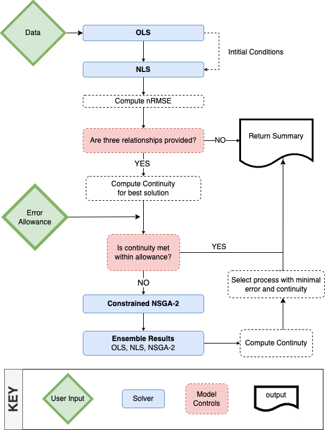

```{r, include = FALSE}
knitr::opts_chunk$set(
  collapse = TRUE,
  comment = "#>"
)
library(ggplot2)
library(dplyr)
library(stats)
library(mco)
```

```{r setup}
library(FHGestimation)
data = nwis
```

## Increasing AHG skill:

In the last section we saw the traditional OLS based fit on our sample data provided a solution that met continuity, but, has a large amount of error. In this section we will explore alternative methods to see 


## Curve Fitting Approaches

When fitting a nonlinear curve to a set of data, the options are: (1) linearize the relationship by transforming the data; (2) fit a polynomial spline to the data; or (3) fit a nonlinear function. With our emphasis on interoperable power law relations, only the linear (1) and nonlinear (3) approaches are appropriate. 

Nonlinear Least Square (NLS) regression provides more flexible curve fitting through an iterative optimization. NLS approaches require a specified starting value for each unknown parameter to ensure the solver converges on a global rather than a local minimum. When suboptimal starting values are provided, NLS solvers may converge on a local minimum, or, not at all.

### OLS

```{r}
ols = function(X, Y, name = NA){
  fit = lm(log(Y) ~ log(X))
  data.frame(coef = exp(fit$coefficients[1]),
             exp  = fit$coefficients[2],
             name = name,
             row.names = NULL)
}

(ols_fit = bind_rows(
        ols(data$Q, data$Y, "Y"),
        ols(data$Q, data$TW, "TW"),
        ols(data$Q, data$V, "V"))%>% 
    mutate(method = "ols"))

sum(ols_fit$exp)
prod(ols_fit$coef)

olsP = data %>% 
  mutate(Yp  = ols_fit$coef[1] * (Q ^ ols_fit$exp[1]),
         TWp = ols_fit$coef[2] * (Q ^ ols_fit$exp[2]),
         Vp  = ols_fit$coef[3] * (Q ^ ols_fit$exp[3]))
         
ols_e = data.frame(
  Ye  = nrmse(olsP$Y, olsP$Yp),
  TWe = nrmse(olsP$TW, olsP$TWp),
  Ve  = nrmse(olsP$V, olsP$Vp)) %>% 
  mutate(tot_error = Ye + TWe + Ve, type = "OLS") 
```

```{r, echo = FALSE}
ggplot() + 
  geom_col(data = tidyr::pivot_longer(ols_e, -type), aes(x = name, y = value, fill = type),
           stat = "identity", position = position_dodge(), alpha = 0.75) + 
  theme_light() + labs(x = "Relationship", y = "nRMSE")
```

### NLS

```{r}
nls = function(X, Y, coef, exp, name = NA){
  s <-  summary(suppressWarnings({
    stats::nls(Y ~ alpha * X ^ x,
        start = list(alpha = coef, x = exp), 
        trace = FALSE,
        control = nls.control(maxiter = 50, tol=1e-09,  warnOnly=TRUE))
  }))
  
  data.frame(coef = s$coefficients[1,1],
             exp  = s$coefficients[2,1],
             name = name,
             row.names = NULL)
}

(nls_fit = bind_rows(
        nls(X = data$Q, Y = data$Y,  coef = ols_fit$coef[1], exp = ols_fit$exp[1], "Y"),
        nls(X = data$Q, Y = data$TW, coef = ols_fit$coef[2], exp = ols_fit$exp[2], "TW"),
        nls(X = data$Q, Y = data$V,  coef = ols_fit$coef[3], exp = ols_fit$exp[3], "V")) %>% 
    mutate(method = "nls"))

sum(nls_fit$exp)
prod(nls_fit$coef)

nlsP = data %>% 
  mutate(Yp  = nls_fit$coef[1] * (Q ^ nls_fit$exp[1]),
         TWp = nls_fit$coef[2] * (Q ^ nls_fit$exp[2]),
         Vp  = nls_fit$coef[3] * (Q ^ nls_fit$exp[3]),
         method = "nls")
         
nls_e = data.frame(
  Ye  = nrmse(nlsP$Y, nlsP$Yp),
  TWe = nrmse(nlsP$TW, nlsP$TWp),
  Ve  = nrmse(nlsP$V, nlsP$Vp)
) %>% 
  mutate(tot_error = Ye + TWe + Ve, type = "NLS") 
```

```{r, echo = FALSE}
e = bind_rows(nls_e, ols_e)

ggplot() + 
  geom_col(data = tidyr::pivot_longer(e, -type), aes(x = name, y = value, fill = type),
           stat = "identity", position = position_dodge(), alpha = 0.75) + 
  theme_light() + labs(x = "Relationship", y = "nRMSE")
```

## NSGA-II

```{r}
allowance = 0.05

# x assumed to be ordered as: k, m, a, b, c, f
objective_function <- function(x) {
      v = nrmse(x[1]*data$Q^x[2], data$V) 
      t = nrmse(x[3]*data$Q^x[4], data$TW) 
      d = nrmse(x[5]*data$Q^x[6], data$Y) 
      return(c(v,t,d))
}

constraint = function(x) {
    return(c((1 + allowance) - (x[1] * x[3] * x[5]),
             (x[1] * x[3] * x[5]) - (1 - allowance),
             (1 + allowance) - (x[2] + x[4] + x[6]),
             (x[2] + x[4] + x[6]) - (1 - allowance)))
}
```

```{r}
set.seed(10291991)

res = nsga2(
      objective_function,
      constraints   = constraint,
      # 6 inputs, 3 outputs, 4 constraints
      idim = 6, odim = 3, cdim = 4,
      # Bounds determined from literature
      lower.bounds  = c(0, 0, 0, 0, 0, 0),
      upper.bounds  = c(3.5, 1, 642, 1, 20, 1),
      # Defaults we've chosen
      generations   = 200,
      popsize       = 32,
      cprob = .5,
      mprob = .1)
```

```{r, echo = FALSE}
{
  opar <-par(mfrow=c(1,2))
  plot(res, xlab="y1", ylab="y2", main="Objective space")
  plot(res$par, xlab="x1", ylab="x2", main="Parameter space")
  par(opar)
}
```

```{r}
vals = res$value[res$pareto.optimal, ]
vals = vals[!duplicated(vals), ]

par  = res$par[res$pareto.optimal, ]
par  = par[!duplicated(par), ]

ahg = par[which.min(rowSums(vals)),]

nsga_fit = data.frame(coef = ahg[c(1,3,5)], exp = ahg[c(2,4,6)], name = c("V", "TW", "Y"), method = "nsga2")

nsgs_e = data.frame(
  Ve = nrmse((ahg[1] * data$Q ^ ahg[2]), data$V) ,
  TWe = nrmse((ahg[3] * data$Q ^ ahg[4]), data$TW), 
  Ye = nrmse((ahg[5] * data$Q ^ ahg[6]), data$Y),
  type = "nsga2") %>% 
  mutate(tot_error = Ve + TWe + Ye)
```


```{r, echo = FALSE}
e = bind_rows(nls_e, ols_e, nsgs_e)

ggplot() + 
  geom_col(data = tidyr::pivot_longer(e, -type), aes(x = name, y = value, fill = type),
           stat = "identity", position = position_dodge(), alpha = 0.75) + 
  theme_light() + labs(x = "Relationship", y = "nRMSE")
```

# Combination Approach

```{r}
d = bind_rows(ols_fit, nls_fit, nsga_fit)
r = split(d, f = d$name)  

fit =  function(g, ind, V, TW, Y, Q, allowance = .05) {
    x = g[ind,]
    g$V_error[ind] =  nrmse(x$V_coef*(Q^x$V_exp), V)
    g$TW_error[ind] = nrmse(x$TW_coef*(Q^x$TW_exp), TW)
    g$Y_error[ind] =  nrmse(x$Y_coef*(Q^x$Y_exp), Y) 
    c1 = round(g$V_coef[ind] * g$Y_coef[ind] * g$TW_coef[ind], 3)
    c2 = round(g$V_exp[ind] + g$Y_exp[ind] + g$TW_exp[ind], 3)
    g$viable[ind] =  (between(c1, 1-allowance, 1+allowance) +  between(c2, 1-allowance, 1+allowance)) == 2
    g
}
    
names = c("V", "TW", "Y")

g = rep(list(c("ols", "nls", "nsga2")), 3) %>% 
    expand.grid() %>% 
    setNames(paste0(names, "_method")) %>% 
    mutate(viable = NA, tot_error = NA) %>% 
    bind_cols(setNames(data.frame(matrix(NA, ncol = 9, nrow =27)), 
                          c(paste0(names, "_error"), paste0(names, "_coef"), paste0(names, "_exp"))))

  
for(t in 1:3){
    x = g[[paste0(names[t], "_method")]]
    ind = match(x, r[[names[t]]]$method)
    
    g[[paste0(names[t], '_exp')]] = r[[names[t]]]$exp[ind]
    g[[paste0(names[t], '_coef')]] = r[[names[t]]]$coef[ind]
}

for(i in 1:nrow(g)){ g = fit(g, i, data$V, data$TW, data$Y, data$Q)}

g$tot_error = rowSums(g[, grepl("error", names(g))], na.rm = TRUE)

combo = filter(g, viable == TRUE) %>% 
      slice_min(tot_error) %>% 
      mutate(condition = "bestValid")
    
ols = filter(g, Y_method == "ols", TW_method == "ols", V_method == "ols") %>% 
      mutate(condition = "ols")
    
nls = filter(g, Y_method == "nls", TW_method == "nls", V_method == "nls") %>% 
      mutate(condition = "nls")
  
nsga = filter(g, Y_method == "nsga2", TW_method == "nsga2", V_method == "nsga2") %>% 
        mutate(condition = "nsga2")

summary = bind_rows(combo, ols, nls, nsga) %>%  
          arrange(!viable, tot_error)
```

```{r, echo = FALSE}
mutate(summary, across(where(is.numeric), round, digits=2)) %>% 
  kableExtra::kable()
```


# Packaged Functionality

The above workflow follows this diagram:

```{r, echo = F, out.width="100%"}

```

And can be executed like this:

```{r, eval = FALSE}
fhg = fhg_estimate(data)
```

**NOTE** Single relationships can also be fit like this:

```{r}
fhg_estimate(select(data, Q, Y))
```
